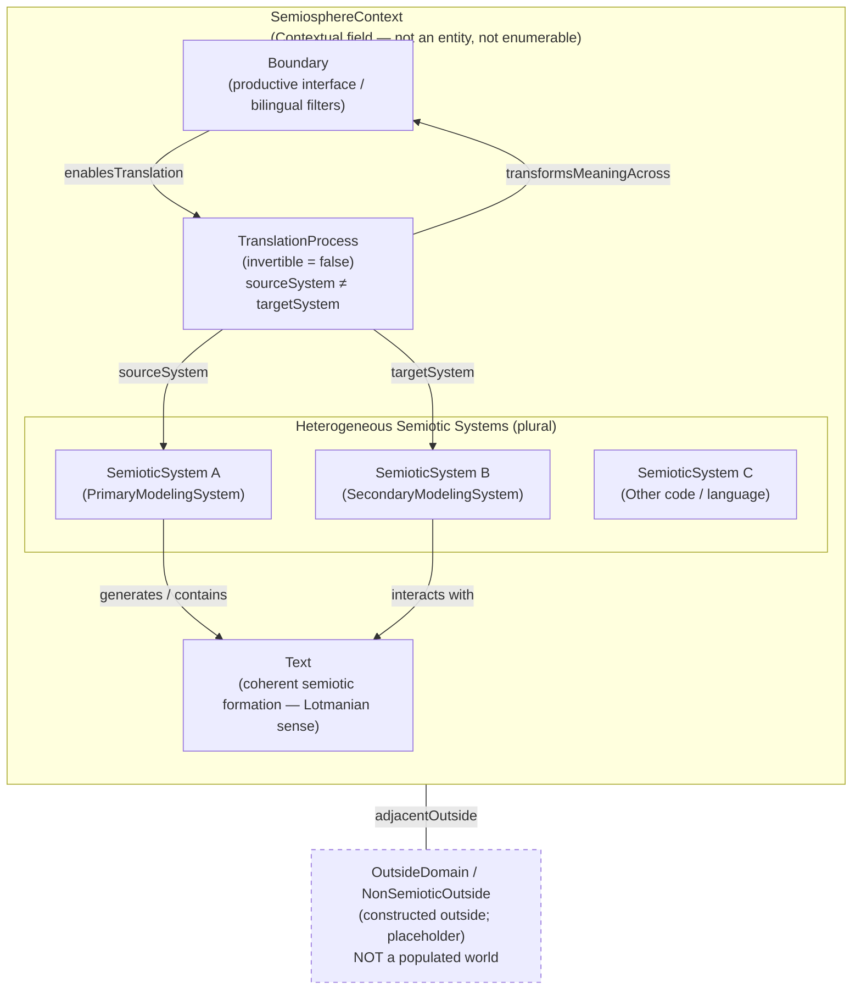
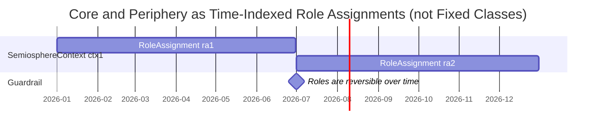
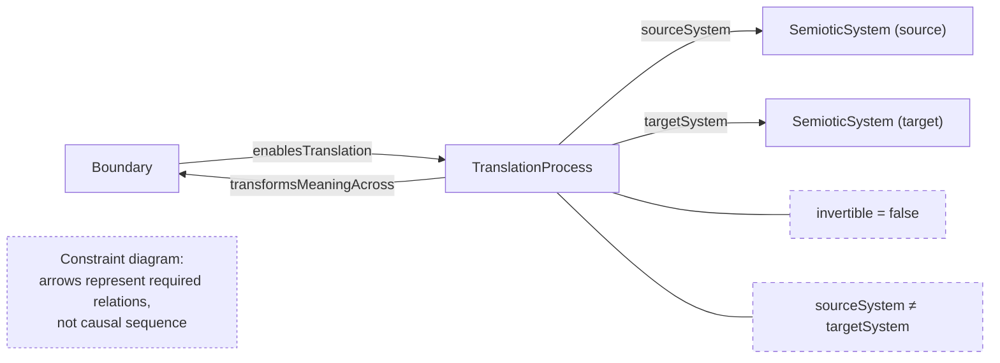
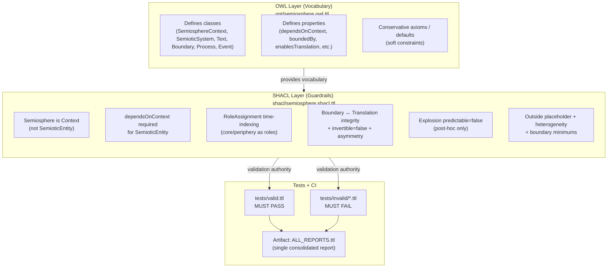

# Semiosphere Ontology — Diagrams

These diagrams are rendered natively by GitHub from the Mermaid fenced blocks below.
No build step or CI pipeline is required.

---

## Diagram 1 — Conceptual Topology of the Semiosphere

Illustrates the relational structure of the semiosphere: heterogeneous semiotic systems, texts, boundaries, and translation processes operating within a contextual field, with a constructed outside.

---

## Diagram 2 — Core and Periphery as Time-Indexed Role Assignments

Shows that core and periphery are not fixed classes but reversible roles assigned to semiotic systems over time within a given semiosphere context.

---

## Diagram 3 — Boundary and Translation Flow (Constraint Diagram)

Captures the required relations between Boundary, TranslationProcess, and SemioticSystems, along with the asymmetry and non-invertibility constraints.

---

## Diagram 4 — OWL vs SHACL Layer Responsibilities

Maps the division of responsibility between the OWL vocabulary layer, the SHACL guardrails layer, and the CI test suite.

